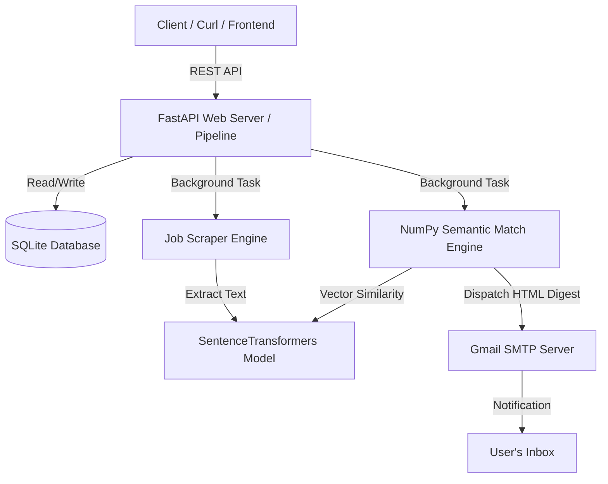
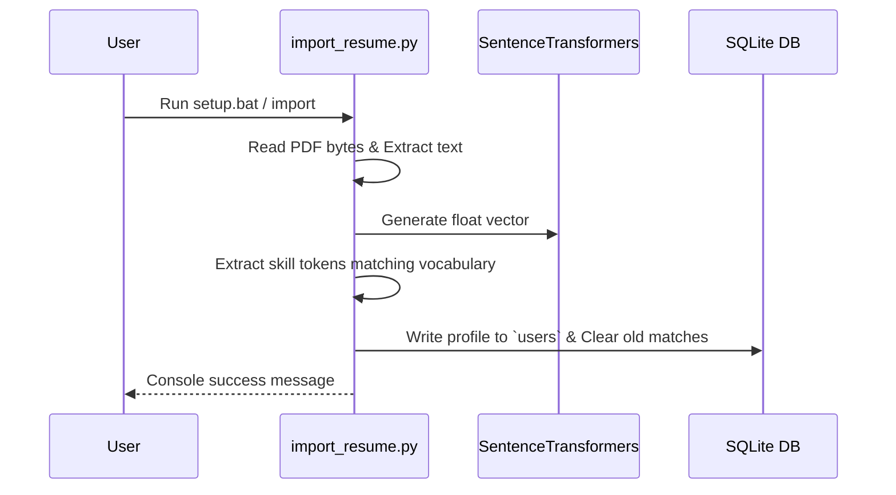

# AI Job Scraper — Project Architecture

This document provides a detailed overview of the system architecture, file layout, database schema, processing loops, and execution workflows of the **100% Python AI Job Scraper** application.

---

## 1. System Architecture Overview

The system is designed as a lightweight, high-performance application built entirely on Python. It can run as either a persistent **FastAPI** web server or a serverless pipeline via **GitHub Actions**. It utilizes **SentenceTransformers** for semantic embeddings, **NumPy** for vector arithmetic, and **SQLite** for relational storage.



### Key Technical Advantages
- **Single Runtime**: Eliminates subprocess spawning, inter-process communication latency, and multiple environment setups (0% Node.js/JavaScript).
- **SIMD Calculations**: Vector similarity math (cosine similarity) is calculated natively at AVX/SSE speeds using **NumPy** array operations.
- **In-Memory Models**: The `sentence-transformers/all-MiniLM-L6-v2` model is loaded once on startup, providing sub-200ms semantic embedding generation.
- **Thread-Safe Concurrency**: Background tasks (scraping, matching, and database cleaning) operate concurrently with REST API queries using SQLite connection queue timeouts.

---

## 2. Directory Layout

The simplified, clean directory structure of the application is as follows:

```
AI-Job-Scraper/
├── backend/
│   ├── data/
│   │   ├── jobs.db              # SQLite relational database
│   │   └── skills_vocab.json    # Pre-compiled dictionary of technical skills
│   ├── nlp_service/
│   │   ├── venv_nlp/            # Python virtual environment (auto-created)
│   │   ├── app.py               # FastAPI server and REST endpoints entry point
│   │   ├── scraper.py           # Multi-ATS scraper orchestrator
│   │   ├── matcher.py           # NumPy-based semantic match calculations
│   │   ├── email_sender.py      # SMTP-based HTML email digest engine
│   │   ├── import_resume.py     # Offline/Online PDF resume parser script
│   │   └── requirements.txt     # Python package dependencies
│   ├── companies_config.json    # User-editable list of active companies
│   ├── .env                     # Environment variables (Credentials & config)
│   └── setup.bat                # Windows setup and launch script
└── Saurabh_Surashe.pdf          # User's PDF resume in workspace root
```

---

## 3. Database Schema

All data is stored inside `backend/data/jobs.db`. The relational schema comprises four primary tables:

### 3.1. `users`
Tracks registered user profiles, resume vectors, extracted skills, and configuration preferences.
- `email` (TEXT, PRIMARY KEY): Recipient email address.
- `resume_text` (TEXT): Plain text content parsed from the PDF.
- `resume_vector` (TEXT): JSON array containing the float vector representation of the resume.
- `resume_skills` (TEXT): JSON array of extracted skill tokens.
- `selected_companies` (TEXT): JSON array of company names selected for matching.
- `match_threshold` (REAL): Minimum match score (0-100) to notify.
- `resume_uploaded_at` (TEXT): ISO timestamp of upload.
- `last_notified_at` (TEXT): ISO timestamp of the last successful email digest.
- `created_at` (TEXT): Account creation timestamp.

### 3.2. `companies`
Lists tracked employers, ATS portals, scraped records, and degradation tracking.
- `name` (TEXT, PRIMARY KEY): Unique company identifier (e.g., "AMD", "NVIDIA").
- `ats` (TEXT): Portal type (e.g., "workday", "smartrecruiters", "cisco", "eightfold", "eightfold_v2", "greenhouse", "amd", "ibm", "arm").
- `tier` (INTEGER): Priority level for scraping.
- `career_url` (TEXT): URL to the career home page.
- `status` (TEXT): Status flags (`active`, `degraded`).
- `last_scraped_at` (TEXT): ISO timestamp of last run.
- `degraded_reason` (TEXT): Logs error details if scraper fails.

### 3.3. `jobs`
Stores scraped job postings, locations, description details, and pre-calculated NLP vectors.
- `company_name` (TEXT): References `companies.name`.
- `job_id` (TEXT): ATS unique job ID.
- `job_title` (TEXT): Clean job title.
- `location` (TEXT): Job location (e.g., "Pune, IN", "London, UK", etc.).
- `department` (TEXT): Job department.
- `posted_date` (TEXT): ISO or relative date.
- `employment_type` (TEXT): Job type (e.g., "Full-time").
- `job_description` (TEXT): Clean description text.
- `url` (TEXT): Link to view details.
- `apply_url` (TEXT): Direct application link.
- `skills_display` (TEXT): JSON list of extracted skill keywords.
- `required_yoe` (INTEGER): Extracted minimum years of experience.
- `embedding_status` (TEXT): Processing flags (`pending`, `done`, `failed`).
- `title_vector` (TEXT): Embedding representation of the title.
- `description_vector` (TEXT): Embedding representation of the description.
- `embedding_vector` (TEXT): Embedding representation of the combined text.
- `scraped_at` (TEXT): Timestamp of acquisition.
- `expires_at` (TEXT): Expire limit based on retention settings.
- *Primary Key*: `(company_name, job_id)`

### 3.4. `matched_jobs`
Deduplicates matches and records notification dispatch histories.
- `email` (TEXT): Recipient user.
- `job_id` (TEXT): Reference to job.
- `company_name` (TEXT): Reference to company.
- `match_score` (REAL): Similarity percentage (0-100).
- `job_title` (TEXT): Job title at time of match.
- `location` (TEXT): Location details.
- `apply_url` (TEXT): Link to apply.
- `skills_display` (TEXT): JSON list of skills.
- `required_yoe` (INTEGER): YoE requirement.
- `notified` (INTEGER): Binary flag (`0` for pending, `1` for sent).
- `notified_at` (TEXT): ISO timestamp of sent email.
- `expires_at` (TEXT): Expiration limit.
- *Primary Key*: `(email, company_name, job_id)`

---

## 4. Key Application Engines

### 4.1. Execution Gateways (`app.py` & `workflow_runner.py`)
- **FastAPI Web Server (`app.py`)**:
  - Exposes REST API endpoints.
  - Runs background execution pools for tasks like scraping and matching, keeping responses non-blocking.
  - Implements two background loops on startup:
    1. **Scraping Loop**: Runs every 6 hours (configurable via `SCRAPE_INTERVAL_HOURS`).
    2. **Cleanup Loop**: Runs daily at 2:00 AM, purging expired records from the database.
- **Serverless Pipeline (`workflow_runner.py`)**:
  - Executes the full data pipeline (init, import, scrape, match, cleanup) sequentially in a single pass without booting a web server.
  - Designed specifically for automated chron execution via GitHub Actions.

### 4.2. Multi-ATS Scraper Engine (`scraper.py`)
- Acts as a dynamic orchestrator that crawls active companies **in parallel** using a `ThreadPoolExecutor` worker pool.
- The concurrency limit is configurable via `maxConcurrentCompanies` (default: 3) to optimize CPU usage during parallel embedding generation.
- Utilizes a global thread lock (`db_lock`) to synchronize SQLite database reads and writes safely, releasing the lock during network HTTP requests and CPU-heavy `model.encode()` embedding calculations to prevent database locks while maintaining maximum parallelism.
- Instead of housing all scraping logic, it imports specific, highly-modular ATS adapters from the `backend/nlp_service/adapters/` directory (e.g., `workday.py`, `eightfold_v2.py`, `greenhouse.py`).
- Respects `robots.txt` rules and rate limits for each site via centralized `utils.py` helpers.
- **Fault Tolerance**: Safely catches network timeouts, HTTP errors, or `robots.txt` blocks to gracefully exit the specific company's extraction function without crashing the global loop, allowing the thread pool to immediately pick up the next company.
- Directly invokes native site API endpoints (JSON REST services) to retrieve jobs, avoiding heavy headless browser instances.
- For each job posting, it extracts matching skills from `skills_vocab.json` using word boundary regex patterns, parses the YoE requirements, and calculates vector representations using SentenceTransformers.
- **Programmatic Filtering**: For custom HTML-scraped portals like ARM, the scraper reads the configured company location filters (e.g., India, UK, Europe) and filters the scraped jobs programmatically in Python since the portal does not support standard URL query parameters for these filters.


### 4.3. Semantic Match Engine (`matcher.py`)
- Computes matching between the user's resume vector and scraped jobs:
  - **Weighted Similarity**:
    $$\text{Score} = (\text{Cosine Similarity}_{\text{Title}} \times 0.5) + (\text{Cosine Similarity}_{\text{Description}} \times 0.5)$$
  - **YoE Verification**: Determines if the job's minimum experience exceeds the user's configured experience.
  - **Deduplication**: Inserts new matches into `matched_jobs` with `notified = 0`.
  - **Location-Based Prioritized Sorting**: Groups matches prioritizing India-based jobs first (Rank 0), then United Kingdom and Europe (Rank 1), then Remote roles (Rank 2), then other regions (Rank 3), and sorts by score descending within each group.

### 4.4. SMTP Email Digest Engine (`email_sender.py`)
- Dispatches digests using Gmail SMTP.
- Renders premium-styled HTML cards with Google Fonts, micro-elements, and status warning labels (`✅ Experience Match` or `⚠️ Experience Mismatch`).

---

## 5. Main Processing Flows

### 5.1. Resume Import Flow


### 5.2. Background Scraping & Matching Flow
```mermaid
sequenceDiagram
    participant Loop as Background Loop
    participant Scraper
    participant Model as SentenceTransformers
    participant Matcher
    participant DB as SQLite DB
    participant SMTP as SMTP Server
    
    Loop->>Scraper: Trigger hourly cycle
    Scraper->>DB: Query active companies
    loop Every Company
        Scraper->>Scraper: Check robots.txt & Fetch API data
        loop Every Job
            Scraper->>Model: Encode Title & Description text
            Scraper->>DB: Insert new job with embedding vectors
        end
    end
    Scraper-->>Loop: Cycle complete
    Loop->>Matcher: Trigger Match Cycle
    Matcher->>DB: Query users and matching jobs
    loop Every User
        Matcher->>Matcher: Compute cosine similarities using NumPy
        Matcher->>Matcher: Validate experience & Filter by threshold
        Matcher->>DB: Insert pending matches (notified = 0)
        Matcher->>DB: Query combined pending matches
        Matcher->>Matcher: Sort: India first, then UK/Europe, then Remote, then others, DESC score
        Matcher->>SMTP: Connect & send HTML digest
        Matcher->>DB: Mark matched_jobs as notified = 1
    end
    Matcher-->>Loop: Matching complete
```

---

## 6. Concurrency & Reliability Mitigations

### 6.1. Database Connection Timeout
SQLite only allows a single writer transaction. To prevent `database is locked` errors during concurrent background scraping writes and REST API writes, all database connection objects are instantiated with a timeout configuration:
```python
conn = sqlite3.connect(db_path, timeout=30.0)
```
This forces the request thread to block and queue for up to 30 seconds, allowing background processes to complete their database transactions without dropping HTTP requests.

### 6.2. Timezone Offset Normalization
Dates scraped from ATS portals may contain timezone offsets (e.g. `+05:30` or `Z`). Python's `datetime.fromisoformat` parses these into offset-aware datetimes. To prevent `TypeError: can't compare offset-naive and offset-aware datetimes` during comparison checks, datetimes are normalized to naive representations:
```python
posted_dt = datetime.fromisoformat(s)
if posted_dt.tzinfo is not None:
    posted_dt = posted_dt.replace(tzinfo=None)
```

### 6.3. Database Size Mitigation (VACUUM)
Because standard SQL `DELETE` commands do not reclaim storage space on disk in SQLite, a database file can grow indefinitely over time. To keep the database size small and avoid exceeding GitHub's 100 MB file limit, the system executes `VACUUM` at the end of the `run_cleanup` cycle, reclaiming unused space and shrinking the file size down to the actual volume of current data.

